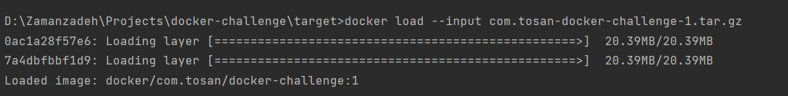
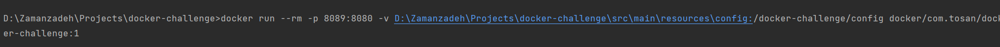
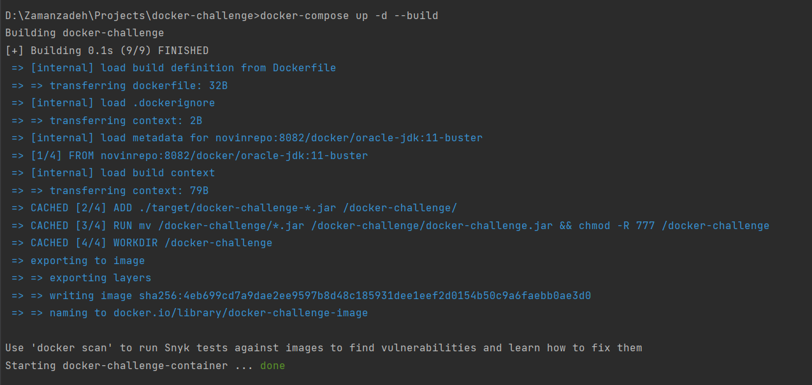
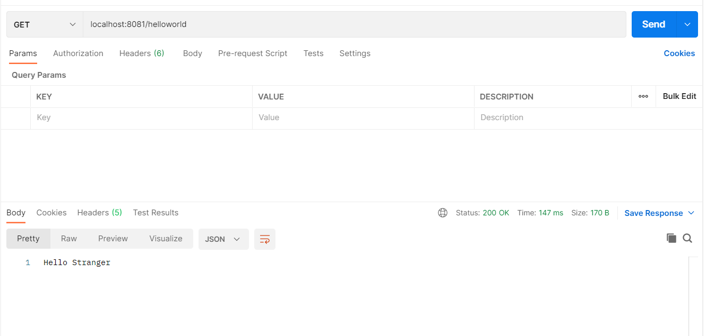
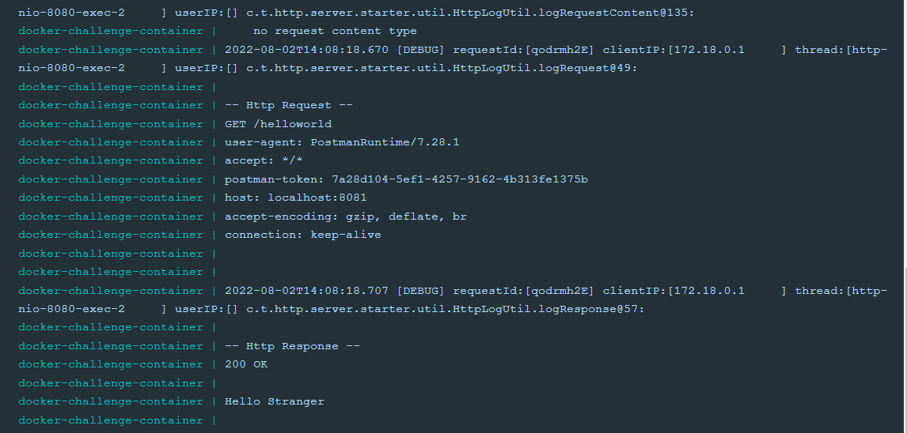
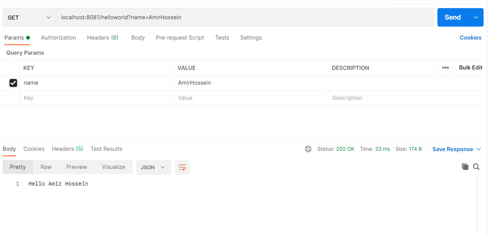
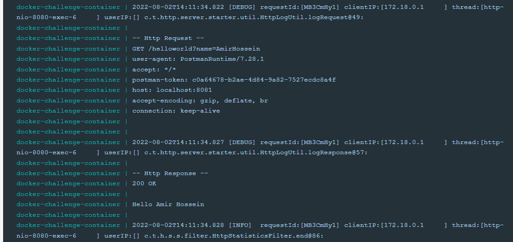
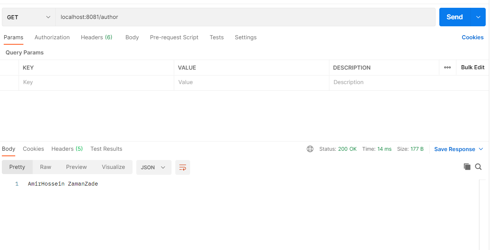
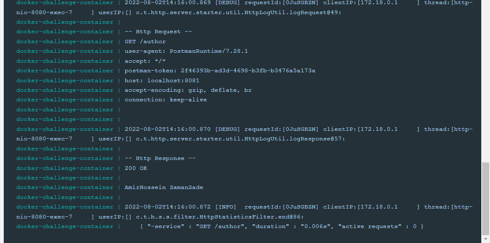

# Docker-challenge

### Run container without docker-compose
for running container without docker-compose first we must generate an image of our project.
after generate image we must load this image to our docker images with this command : 
 docker load --input image-name
 After we load image we must to run container but we must do something to bind ports and mount configuration for do this we use this command:
  docker run --rm -p host-port:container-port -v host-prop-dir:container-prop-dir image:tag

###Run with docker-compose

Run container with docker compose is too simple.
you just need to configure docker-compose.yaml file  and after that execute this command :
  docker-compose up --build

Note: you can configure port binding , config mount and ... in docker-compose.yaml

Note: for changing the port that application is listening to you just need to change the server.port key in application.properties and restart the container.

###Test endpoints

we run our application on port 8080 and bind it to our 8081 host port.

test localhost:8081/helloworld

host log:

test localhost:8081/helloworld?name=AmirHossein

as you can see the response is get cuts by spaces.
host log:

test localhost:8081/author

host log:

